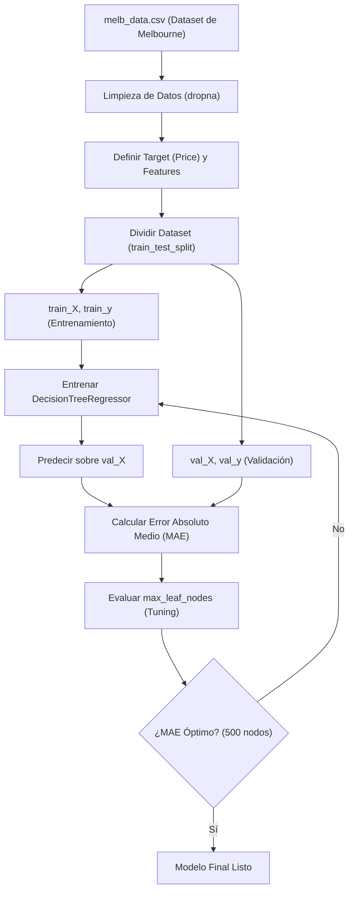

# 🤖 Aprendizaje Supervisado: Validación y Optimización de Modelos

¡Bienvenido al repositorio de **Validación y Ajuste de Modelos de Machine Learning**! Este proyecto tiene como objetivo ilustrar de forma práctica y pedagógica cómo evaluar el rendimiento de un modelo predictivo, diagnosticar problemas de **sobreajuste (overfitting)** y **subajuste (underfitting)**, y optimizar hiperparámetros utilizando un **Árbol de Decisión (`DecisionTreeRegressor`)** sobre el clásico dataset de precios de viviendas de Melbourne (`melb_data.csv`).

---

## 📋 Tabla de Contenidos
- [✨ Características Principales](#-características-principales)
- [🏗️ Estructura del Proyecto](#️-estructura-del-proyecto)
- [🔄 Flujo de Trabajo (Workflow)](#-flujo-de-trabajo-workflow)
- [⚙️ Requisitos e Instalación](#️-requisitos-e-instalación)
- [📘 Resumen de Lecciones](#-resumen-de-lecciones)
  - [Lección 1: Validación de Modelos](#lección-1-validación-de-modelos)
  - [Lección 2: Underfitting y Overfitting](#lección-2-underfitting-y-overfitting)
- [📊 Resultados Obtenidos](#-resultados-obtenidos)
- [🚀 Cómo Ejecutar](#-cómo-ejecutar)

---

## ✨ Características Principales
* **Métricas Claras:** Implementación y explicación matemática y práctica del **Error Absoluto Medio (MAE)**.
* **Validación Cruzada vs. Validación Simple:** Demostración del error crítico de validar "dentro de la muestra" (*in-sample*) y cómo solucionarlo con división de entrenamiento/prueba (*train-test split*).
* **Búsqueda del Punto Óptimo:** Control de la complejidad del modelo ajustando el parámetro `max_leaf_nodes` para evitar el ruido y capturar patrones reales.
* **Visualización de Datos:** Gráficos dinámicos con `seaborn` y `matplotlib` para mapear el MAE frente a la cantidad de nodos.

---

## 🏗️ Estructura del Proyecto

```text
machine_learningCD/
├── data/
│   └── melb_data.csv       # Dataset de viviendas de Melbourne (Kaggle)
├── img/
│   ├── mae.png             # Gráfico conceptual de error vs complejidad
│   └── tree3.png           # Diagrama conceptual de divisiones de un árbol
├── 1_validacion_modelos.ipynb         # Lección 1: MAE y división de datos
├── 2_underfitting_y_overfitting.ipynb # Lección 2: Optimización de max_leaf_nodes
├── requirements.txt        # Dependencias del proyecto
└── README.md               # Documentación principal (este archivo)
```

---

## 🔄 Flujo de Trabajo (Workflow)

El siguiente diagrama de flujo ilustra el ciclo completo implementado en los cuadernos para entrenar, validar y optimizar el modelo de regresión:



---

## ⚙️ Requisitos e Instalación

Este proyecto requiere **Python 3.10+** y los paquetes listados en `requirements.txt`.

### 1. Clonar o acceder al directorio del proyecto:
```bash
cd machine_learningCD
```

### 2. Crear y activar un entorno virtual:
```bash
# En macOS/Linux
python -m venv .venv
source .venv/bin/activate
```

### 3. Instalar las dependencias necesarias:
```bash
pip install -r requirements.txt
```

> [!NOTE]
> Las dependencias principales instaladas son:
> * `scikit-learn` - Para la creación, división y evaluación del modelo.
> * `pandas` - Para manipulación y limpieza de datos estructurados.
> * `numpy` - Para operaciones numéricas eficientes.
> * `seaborn` & `matplotlib` - Para visualización de métricas y tendencias.
> * `jupyterlab` - Para la visualización y ejecución interactiva de cuadernos.

---

## 📘 Resumen de Lecciones

### Lección 1: Validación de Modelos
Esta sección aborda la pregunta fundamental: **¿Qué tan preciso es nuestro modelo con datos nuevos?**

* **Métrica MAE:** Se introduce el Error Absoluto Medio, definido formalmente como:
  $$\text{MAE} = \frac{1}{n} \sum_{i=1}^{n} |y_i - \hat{y}_i|$$
  *En términos sencillos: "En promedio, nuestras predicciones están equivocadas por X cantidad de dólares".*
* **La trampa del error "In-Sample":** Se demuestra que si evaluamos el modelo con los mismos datos con los que entrenó, el error será artificialmente bajo (~$500), pero fallará estrepitosamente con datos reales.
* **Solución:** Se implementa `train_test_split` de Scikit-Learn para reservar un **25%** de los datos exclusivamente para validación, asegurando una evaluación honesta y realista.

### Lección 2: Underfitting y Overfitting
En esta lección exploramos cómo controlar la complejidad del árbol de decisión para encontrar el equilibrio perfecto.

* **Sobreajuste (Overfitting):** Ocurre cuando el árbol es demasiado profundo. El modelo memoriza el ruido y las peculiaridades del set de entrenamiento, incrementando el error en los datos de validación.
* **Subajuste (Underfitting):** Ocurre cuando el árbol es demasiado superficial (pocas hojas). El modelo no logra capturar los patrones generales y tiene un rendimiento deficiente tanto en entrenamiento como en validación.
* **Optimización (`max_leaf_nodes`):** Se crea una función iterativa `calcular_mae` para probar múltiples configuraciones de nodos (`[5, 50, 500, 600, 700, 800, 1000, 5000]`), analizando la curva de error resultante.

---

## 📊 Resultados Obtenidos

Al realizar el análisis de validación y optimización de hiperparámetros sobre la base de datos de viviendas de Melbourne con las siguientes columnas predictoras (*Features*):
* `Rooms` (Habitaciones)
* `Bathroom` (Baños)
* `Landsize` (Tamaño del terreno)
* `BuildingArea` (Área de construcción)
* `YearBuilt` (Año de construcción)
* `Lattitude` (Latitud)
* `Longtitude` (Longitud)

Se obtuvieron los siguientes valores de **MAE**:

| Nodos Permitidos (`max_leaf_nodes`) | MAE (Dólares) | Estado del Modelo |
|:-----------------------------------:|:-------------:|:-----------------:|
| 5                                   | $347,380      | 🔴 Subajuste (Underfitting) |
| 50                                  | $258,171      | 🟡 Acercándose al óptimo |
| **500**                             | **$243,495**  | 🟢 **Punto Óptimo (Best Fit)** |
| 600                                 | $243,908      | 🟡 Inicio de Sobreajuste |
| 800                                 | $244,929      | 🟡 Sobreajuste leve |
| 5000                                | $254,432      | 🔴 Sobreajuste (Overfitting) |

> [!IMPORTANT]
> **Conclusión:** Permitir un máximo de **500 nodos de hojas** ofrece el rendimiento óptimo, reduciendo el error absoluto medio de predicción al mínimo antes de que el sobreajuste empiece a deteriorar la capacidad de generalización del modelo.

---

## 🚀 Cómo Ejecutar

Para abrir y experimentar con los cuadernos en tu computadora local:

1. Inicia JupyterLab en tu terminal:
   ```bash
   jupyter lab
   ```
2. En la interfaz web de Jupyter, abre el archivo `1_validacion_modelos.ipynb` y ejecuta las celdas secuencialmente para observar el impacto de la separación de datos de validación.
3. Posteriormente, abre `2_underfitting_y_overfitting.ipynb` para visualizar de manera gráfica cómo se optimiza el modelo de Machine Learning mediante la curva de entrenamiento y validación.

---
*Desarrollado como recurso de aprendizaje interactivo para fundamentos de Ciencia de Datos y Machine Learning.*
